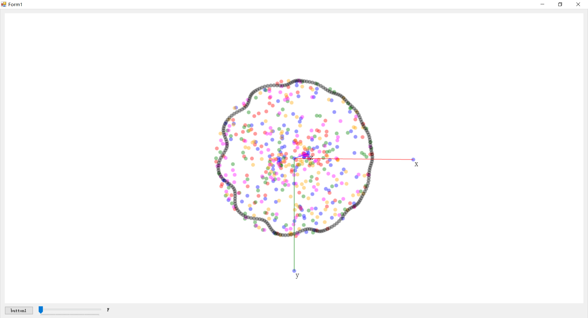

# CSharp 3D Chart

## Overall
C# 3D chart plot grammar and demo project which using matrix transform to simulate the 3d scense.
This project is forked from [Scatter-master](https://github.com/ofirbo/Scatter). In the same time has
referenced projects of [Plotter3D](https://github.com/foman/Plotter3D) etc

本项目进行今天晚上的改进，实现了坐标轴的绘制，以及指向的明确，方便进一步的开发。

## Plans
下一次更新的的计划： 
* 使用图层和双缓冲的概念更新绘图;
* 实现坐标轴;
* 实现坐标轴网格;
* hittest
* 实现线绘制
* 实现球绘制
* 实现立方体、椭球、球的绘制
* 实现面的渲染绘制

## Versions
V 0.1.0 
WNEG  2019.2.19
